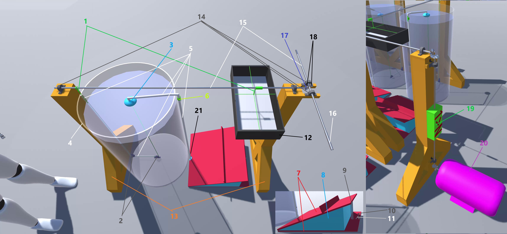

# Generating electricity using gravity (G.E.G.)

- My English level is not good. This README.md file has been converted into English with the help of translation.
- The original document is the [README_Turkish.md](./README_Turkish.md) file.

## Preview

https://github.com/AhmetYildiz0/Generating-electricity-using-gravity/assets/76514989/e522691c-a4d8-4947-9345-540dff65f534

https://github.com/AhmetYildiz0/Generating-electricity-using-gravity/assets/76514989/35c3e52c-2e83-4c04-89bc-c9378251eedc

https://github.com/AhmetYildiz0/Generating-electricity-using-gravity/assets/76514989/c761d4f5-3066-476c-91c3-62d33293b9fc

## Parts

1. Rope
2. Fixed rope pulley
3. Balloon
4. Barrel filled with water or salt water
5. Pipe
6. Air valve
7. Two plates connected to each other with a hinge
8. Balloon of air pump
9. Spring of air pump
10. Lock
11. Lock spring
12. Weight basket
13. Aluminum profile
14. Bearing with housing
15. Aluminum rod
16. Combiner
17. one-way bearing
18. Cone gear
19. Gearbox
20. Electric motor
21. Air intake

## Working principle
* ### Single G.E.G
	1. The weight basket transfers its downward movement to the intermediate shaft with the rope under the effect of gravity.
	2. The intermediate shaft, with its one-way bearing, only transfers the falling movement of the weight to the main shaft.
	3. As the weight basket goes down, the balloon also goes down to the bottom of the water. With the pressure of the water, the air remaining in the balloon flows into the air pump.
	4. The air valve closes just before the weight basket touches the air pump.
	5. The weight basket compresses the air pump underneath and transfers all the air to the pipe with the air valve closed.
	6. Tighten and lock the air pump completely. Immediately afterwards, the air valve opens.
	7. All the air in the pipe is transferred to the balloon in the barrel filled with water or salt water connected to the pipe.
	8. The balloon, which is connected to the intermediate shaft with a rope, rotates the intermediate shaft with the upward movement caused by the buoyancy force of the water.
	9. The rotating intermediate shaft lifts the weight basket up again, and the one-way bearing does not transfer this movement to the main shaft.
	10. When the weight reaches the desired height, the air pump is unlocked and the pump, whose internal space increases with the effect of the spring, takes the air in the balloon back into itself.
	11. The weight, freed from the buoyancy of the water, falls down again and all stages are repeated from the beginning.

* ### Multiple G.E.G.
	*	Two opposing G.E.G can share the same main shaft.
	*	Main shaft of each G.E.G can be spliced together.
	*	In order for electricity production to continue constant, the timing of the drop of weights in G.E.G. must be adjusted.

* ### Electric Motor Part
	*	The main shaft transmits a power equal to the sum of the falling weights in the system to the gearbox.
	*	To use the full capacity of the electric motor, the gearbox increases the rotation of the main shaft N times.
	*	And the electric motor produces electricity.
## Design order
*	The amount of electricity needed is determined (kwh).
*	The number and power of electric motors required to produce electricity are determined.
*	The number of engine RPM required for electric motors to produce the desired power is determined.
*	The total amount of power required to reach the specified number of engine RPM is converted into kilograms.
*	The determined kilogram amount is the sum of the weights dropped. This much weight must also be the amount of weight going up, so the total is multiplied by 2.
*	It is determined how many G.E.G.'s will be used and the total weight is distributed among these G.E.G.'s. In order for the system to produce regular and uninterrupted electricity, there must be at least 3 G.E.G.'s.
*	The lifting power of the air pump and balloon in the G.E.G.s must be enough to lift the weight baskets.
*	All other parts of the G.E.G.s must be able to withstand the weight and buoyancy of the balloon.
*	The air pump's valve and lock are used to adjust the timings so that both the G.E.G.'s own cycle and the cycle between G.E.G.'s can continue smoothly.

## Notes
*	Images are rough animations prepared in Unity(2022.3.11f1) to demonstrate the working principle of G.E.G..
*	I initially designed it to reduce centralized electricity production and distribution.
*	It still has many shortcomings. This design is not the final stage of G.E.G., but a baby step. For example;
*	It can change the dimensions and increase the numbers according to the amount of electricity desired to produce.
*	By adding bends to the main shaft, the G.E.G.'s, which are normally arranged in a row, can be placed more easily in the area.
*	A folded design can be created with small changes and additions to the support part and main shaft. Thus, for large-scale electricity production, many small parts can be used instead of using large parts that are costly to make and transport.
*	If the water barrel is closed and the weight is prevented from swinging, it can also be used in moving places (such as trucks, trains, cargo ships).
*	It can be used anywhere in space where there is sufficient artificial or natural gravity and you can create buoyancy.
*	I tried to simplify the mechanism as much as possible. What I aim with this design is;
	*	can be produced and used easily,
	*	be as modular as possible,
	*	adapts to any place or situation with a few minor changes,
	*	Even users can easily repair it when it breaks down,
	*	When it becomes unusable, it can be recycled and produced again without polluting the environment. With electricity produced by other G.E.G.'s.
*	Unfortunately;
	*	Financial problems
	*	Lack of technical knowledge. (If I try to learn and do it at the same time, it will take too long.)
	*	School is not going very well. I need to take care of school lessons. (Iskenderun Technical University - Computer Engineering - 4th grade)
*	I could not produce an ABC due to the main reasons above and other minor problems. I don't know how efficiently it works in the real world.
*	But I am sure that the open source community, universities, companies and countries will make G.E.G. the world's new, cleanest and most efficient energy source.
## Copyright
You can freely produce, use, develop and sell this design and idea. Just saying thank you is enough.
